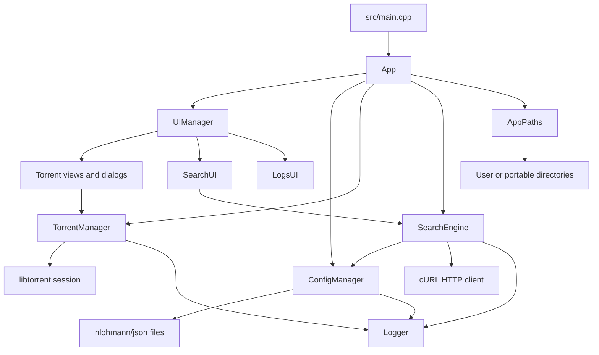
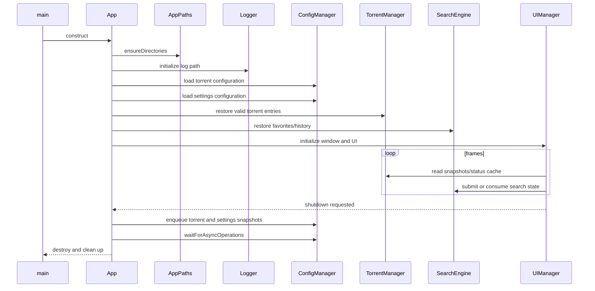
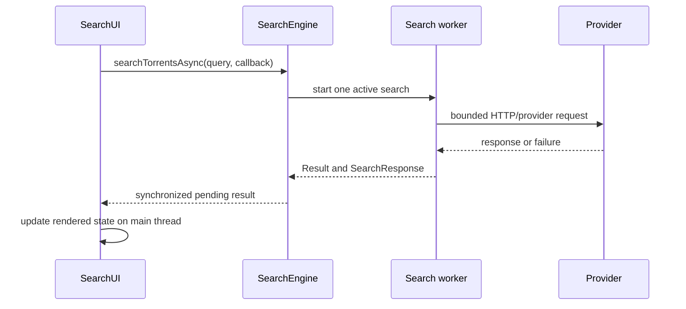

# Architecture

Hypertube is a single desktop process with a Dear ImGui/OpenGL main loop, a libtorrent session, asynchronous search and persistence workers, and platform-specific filesystem helpers.

## Component overview

## Responsibilities

### Application lifecycle

`main.cpp` initializes cURL globally, constructs `App`, runs the UI loop, and cleans up cURL. `App` creates runtime directories, initializes GLFW and logging, loads settings and torrents, then waits for asynchronous persistence during destruction.

### UI layer

`UIManager` owns frame orchestration and coordinates the specialized views:

- `TorrentTableUI`: list, filtering, selection, and torrent actions;
- `TorrentDetailsUI`: files, peers, trackers, status, and settings details;
- `SearchUI`: provider search, pagination, favorites, and result selection;
- `ModalDialogs`: add/remove/save-path flows;
- `LogsUI`: libtorrent alerts and structured application diagnostics;
- `Theme`: reusable Dear ImGui styling.

Dear ImGui calls stay on the main/rendering thread. Views consume copied data or immutable snapshots instead of accessing mutable service containers directly.

### TorrentManager

`TorrentManager` owns the libtorrent session and the maps of handles and torrent file paths. It provides torrent operations, speed limits, sequential-download configuration, proxy configuration, alert polling, and cached status.

- `stateMutex` protects torrent maps and related state;
- `cacheMutex` protects the status cache;
- `getTorrentSnapshot()` provides persistence/UI-safe copies;
- status refresh is bounded by a configurable cache interval.

### SearchEngine

`SearchEngine` owns provider registration, active-provider selection, HTTP search, pagination, cancellation, history, favorites, and asynchronous callbacks. Search settings, providers, favorites, and history have separate synchronization boundaries.

Search requests are bounded by timeout and response-size limits, validate TLS peers/hosts, URL-encode query parameters, and expose cancellation to the cURL progress callback.

### ConfigManager

`ConfigManager` owns JSON schema handling, migration, atomic writes, backup recovery, favorites/history persistence, and an asynchronous save queue.

The configuration mutex protects all access to the shared JSON object. Save requests contain snapshots, so the worker never copies the live configuration while another thread mutates it.

## Startup and shutdown

## Search flow

Worker callbacks must not outlive the owning UI or service. `SearchUI` uses synchronized pending results so rendering remains on the main thread.

## Persistence flow

Locking must remain local to the owning component. Avoid holding a service mutex while waiting on file I/O, network I/O, or another subsystem lock.

## Build target boundaries

The CMake project builds:

- `hypertube_utils`: paths, logger, string helpers, and system helpers;
- `hypertube_config`: configuration and persistence service;
- `hypertube_search`: search provider and HTTP service;
- `hypertube`: UI and application executable;
- `unit_tests`, `config_tests`, and `search_tests`: GoogleTest executables.

New services should be isolated behind a small library when they need independent tests. UI code should depend on service interfaces and snapshots, not implementation details of persistence or libtorrent internals.
