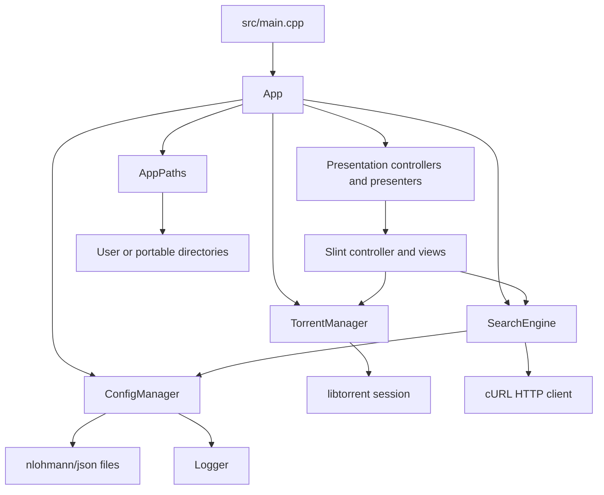
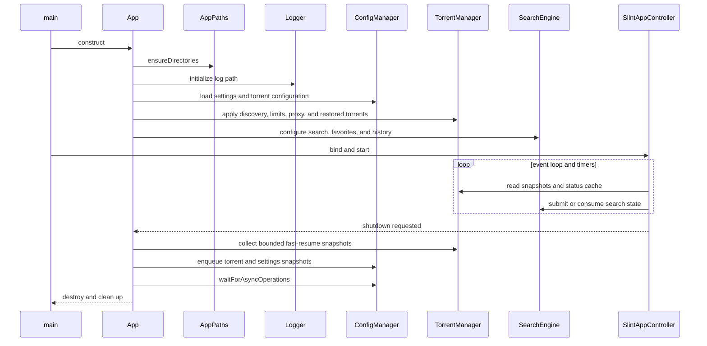

# Architecture

Hypertube is a single desktop process with shared torrent, search, persistence,
and a Slint interface.

## Component overview

## Responsibilities

### Application lifecycle

`main.cpp` initializes cURL globally, constructs `App`, binds the Slint
controller, runs the Slint event loop, and shuts services down in order. `App`
creates runtime directories, initializes logging, loads settings and torrents,
and waits for asynchronous persistence during shutdown.

### UI layer

`SlintAppController` owns property and callback wiring and polls owned DTO
snapshots from the presentation controllers. Specialized Slint views cover the
shell, torrent table, details, search, preferences, and diagnostics. Rendering
and UI mutation stay on the main thread while blocking service work runs behind
owned asynchronous snapshots.

### TorrentManager

`TorrentManager` owns the libtorrent session and maps of handles and torrent
file paths. It provides torrent operations, speed limits, sequential-download
configuration, proxy configuration, alert polling, and cached status.

- `stateMutex` protects torrent maps and related state;
- `cacheMutex` protects the status cache;
- `getTorrentSnapshot()` provides persistence/UI-safe copies;
- status refresh is bounded by a configurable cache interval.

### SearchEngine

`SearchEngine` owns provider registration, active-provider selection, HTTP
search, pagination, cancellation, history, favorites, retries, fallback, and a
bounded in-memory cache. Search requests validate TLS peers and hosts, encode
query parameters, and expose cancellation to the cURL progress callback.

### ConfigManager

`ConfigManager` owns JSON schema handling, migration, atomic writes, backup
recovery, favorites/history persistence, and the asynchronous save queue. Save
requests contain snapshots, so the worker never copies live configuration while
another thread mutates it.

## Startup and shutdown

## Build target boundaries

The CMake project builds:

- `hypertube_utils`: paths, logger, credential storage, string helpers, and system helpers;
- `hypertube_config`: configuration and persistence service;
- `hypertube_torrent`: libtorrent session and torrent operations;
- `hypertube_search`: search provider and HTTP service;
- `hypertube_presentation`: toolkit-neutral DTOs, presenters, and persistence controllers;
- `hypertube`: the Slint application executable;
- `unit_tests`, `config_tests`, `search_tests`, `torrent_tests`, and `slint_model_tests`.

New services should be isolated behind a small library when they need independent
tests. UI code should depend on service interfaces and immutable snapshots, not
implementation details of persistence or libtorrent internals.
